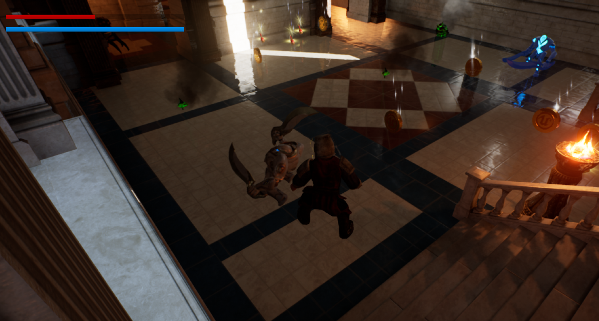
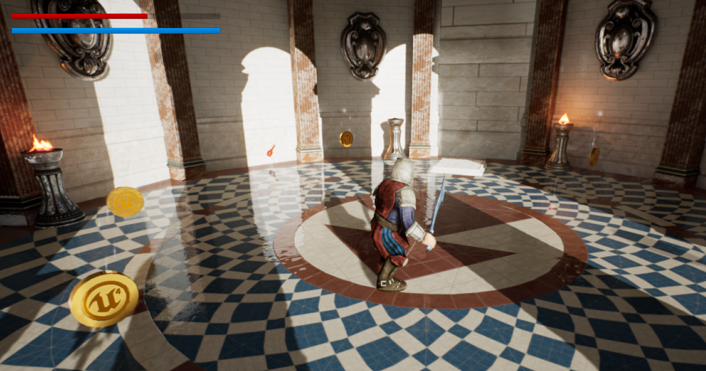

# Medieval game made in Unreal Engine 4

A simple game created in Unreal Engine 4, with available assets and basic mechanisms like attacking, enemies, and some basic challenges.

The source for the game can be downloaded from the drive link [here](https://drive.google.com/file/d/1Aje3Zeg-TkvB0AIV0GBnS_8mUt0IakEz/view?usp=sharing).

Here are the screenshots of the game : -

